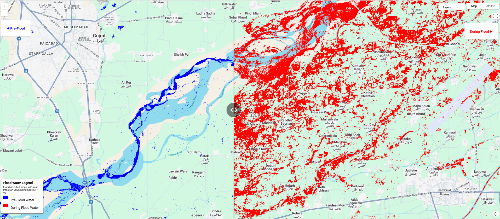

<a href="https://mini-project-461919.projects.earthengine.app/view/pakistan-floods-2025" target="_blank">
  <button style="background-color:#24292e; color:white; padding:8px 16px; border:none; border-radius:5px; cursor:pointer;">
    View
  </button>
</a>

#### Project Overview

Pakistan has been experiencing some of the most severe flooding in its history, with Punjab province among the hardest hit regions in 2025.These floods caused extensive damage to lives, infrastructure, agriculture, and the economy, affecting millions.Accurate and timely flood mapping is critical for disaster response, resource allocation, and recovery planning.

I used **Sentinel-1 Synthetic Aperture Radar (SAR)** data to detect floodwaters in Punjab by analyzing radar backscatter differences between pre-flood and during-flood periods. SAR is especially useful as it can penetrate cloud cover and is unaffected by daylight, providing reliable flood information in all weather conditions.

#### Objectives:

- Detect flood-affected areas in Punjab during a key flood event using radar backscatter thresholding.
- Compare water extent before and during the flood to assess the scale of inundation.
- Provide clear, interactive visualizations with side-by-side maps for easy comparison.

#### Methodology
##### Data Sources
- **Sensor**: Sentinel-1 (C-band Synthetic Aperture Radar)  
- **Product**: `COPERNICUS/S1_GRD`  
- **Polarization**: VV  
- **Mode**: Interferometric Wide Swath (IW)  
- **Resolution**: ~10 meters  

##### Modeling Approach
1. **Filter Sentinel-1 imagery** for Punjab for specified dates.
2. Compute the **median VV polarization image** for each period.
3. Apply a **backscatter threshold** of **-19.5 dB** to identify water-covered areas.

##### Time Periods

| Period       | Date Range             | Purpose               |
|--------------|------------------------|------------------------|
| Pre-Flood    | 2025-06-01 to 2025-06-10 | Baseline water extent |
| During Flood | 2025-08-21 to 2025-09-08 | Flood analysis        |

#### Outputs

**Left Map**: Pre-flood water extent (blue)
**Right Map**: Flood water extent (red)

