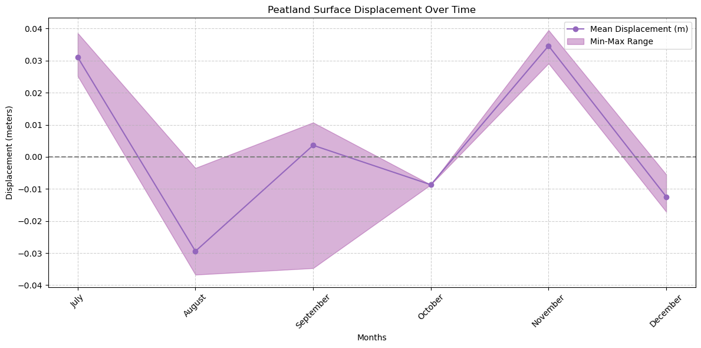
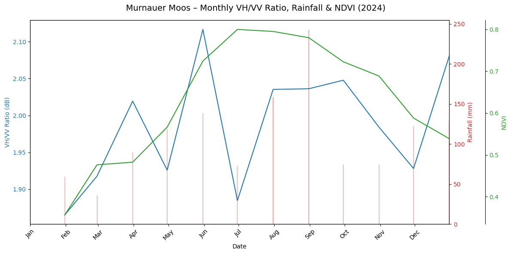

<a href="https://github.com/fyeqaa/Peatland-breathing" target="_blank">
  <button style="background-color:#24292e; color:white; padding:8px 16px; border:none; border-radius:5px; cursor:pointer;">
    View on GitHub
  </button>
</a>

#### Project Overview

Peatlands are among the most effective carbon sinks, storing more carbon than all global forests combined. Their surface motion, also called **peatland breathing**, is a proxy for water level fluctuations and carbon release potential.

In this project, I monitored the **Murnauer Moos** peatland ecosystem in Germany throughout **2023**, leveraging **InSAR displacement**, **NDVI**, **radar backscatter**, and **rainfall data** to understand its dynamic behavior.

#### Data Sources

- **Sentinel-1 InSAR Displacement** (`.geo.unw.tif`)
- **Sentinel-1 VH/VV SAR Backscatter** (COPERNICUS/S1_GRD)
- **Sentinel-2 NDVI** (COPERNICUS/S2_SR_HARMONIZED)
- **Rainfall** (UCSB CHIRPS Daily Precipitation)

#### Methodology

##### 1. **InSAR Displacement**
- Processed **unwrapped phase** files to derive **monthly surface displacement** in meters.
- Filtered low-coherence areas and calculated **mean displacement** for each time window.
- Visualized both time series and **animated maps** showing spatial displacement changes.

#### 2. **Radar Backscatter**
- Calculated **VH/VV ratio** to assess surface wetness and vegetation water content.
- Aggregated to monthly averages for temporal comparison.

#### 3. **Vegetation Monitoring (NDVI)**
- Computed NDVI from Sentinel-2 surface reflectance.
- Used monthly means to track seasonal vegetation growth.

#### 4. **Rainfall Analysis**
- Monthly total rainfall derived from CHIRPS daily data.
- Compared precipitation with InSAR and vegetation response.

###  Results & Visualization

####  Multi-Sensor Time Series Plot
A combined plot visualizing:

- **Blue**: VH/VV radar ratio (moisture)
- **Green**: NDVI (vegetation health)
- **Red bars**: Rainfall
- **Purple (below)**: Mean displacement from InSAR

#### Interpretation

- **Surface Uplift** in July summer correlates with rainfall lagging
- **Subsidence** in late summer/fall may indicate drying or reduced water table despite rainfall.
- InSAR reveals **invisible ground motion** that complements vegetation and climate data.

#### Future Directions

- **Machine Learning Integration**: Model peatland condition and CO₂ release using satellite + in-situ data.
- **Validation**: Compare with water table records or Eddy Covariance data.
- **Generalization**: Expand framework to other peatlands globally.
