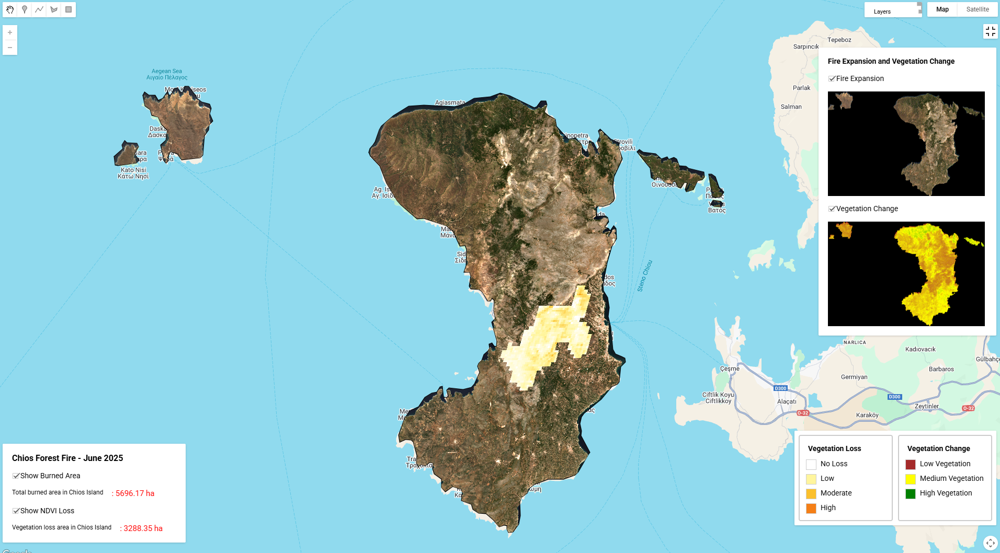

<a href="https://mini-project-461919.projects.earthengine.app/view/chios-forest-fire-june-2025" target="_blank">
  <button style="background-color:#24292e; color:white; padding:8px 16px; border:none; border-radius:5px; cursor:pointer;">
    View
  </button>
</a>

This project analyzes fire expansion and impacts of the June 2025 wildfire on Chios Island, Greece, using satellite remote sensing data. By leveraging Google Earth Engine (GEE) and publicly available satellite datasets, the project visualizes fire progression, burned area, and vegetation health changes.

---

#### Data Sources
- **Sentinel-2 SR Harmonized (COPERNICUS/S2_SR_HARMONIZED)**  
  Used for high-resolution true color imagery and NDVI calculation.
  
- **MODIS Fire Mask (MODIS/061/MOD14A1)**  
  Daily fire detection product to track fire progression.
  
- **MODIS Burned Area Product (MODIS/061/MCD64A1)**  
  Used to identify burned areas and estimate extent.
  
- **MODIS Vegetation Indices (MODIS/061/MOD13Q1)**  
  Used for NDVI time series to track vegetation changes pre- and post-fire.

#### Methodology
1. **Area of Interest (AOI):**  
   Defined as Chios Island (Greece), filtered from FAO GAUL Level 2 dataset.
   
2. **Fire Progression Visualization:**  
   - Filtered MODIS daily fire mask for June 21–25, 2025.  
   - Converted fire detection values to colored overlays.  
   - Composited with static Sentinel-2 true color background.  
   - Animated as a GIF to visualize fire spread.
   
3. **Burned Area Mapping:**  
   - Filtered MODIS burned area data for 2025.  
   - Created binary burned area mask and visualized spatial extent.
   
4. **Vegetation Health Assessment:**  
   - Calculated NDVI from MODIS for June 2025, creating an animation to observe vegetation changes.  
   - Used MODIS MOD13Q1 NDVI data for consistent time series analysis.  

#### Outputs
- Animated GIF of fire progression on Sentinel-2 background.
- Burned area map for 2025 wildfire season.
- NDVI animation showing vegetation health over June 2025.
- NDVI difference map highlighting vegetation loss due to fire.

